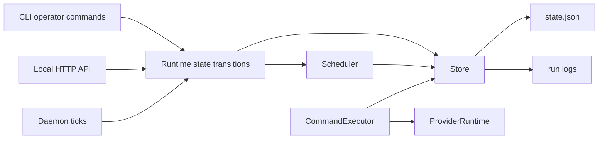
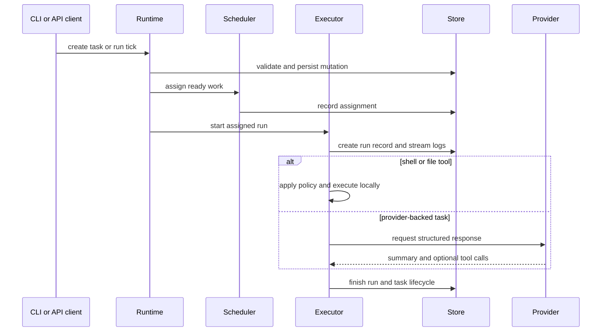

# Architecture

Agent OS is a local-first runtime for coordinating agent work. The binary and library share the same core runtime, so CLI commands, daemon ticks, and API mutations operate on the same durable state model.

## Components

- `OperatingSystem`: the durable state model for agents, tasks, tools, memory, workflows, runs, policy, provider settings, daemon status, and events.
- `Store`: lock-protected persistence around the state file, run logs, import/export, backup, migration, prune, validation, and repair.
- `Scheduler`: capability-aware task assignment. It picks ready pending work and assigns it to online agents with matching capabilities and available capacity.
- `Runtime`: state transitions for registering agents, creating and updating tasks, managing workflows, lifecycle changes, stale recovery, and scheduler ticks.
- `CommandExecutor`: shell execution, file tools, provider-backed tasks, live logs, cancellation, and run completion.
- `ProviderRuntime`: deterministic mock provider for offline development, HTTP adapters for OpenAI-compatible chat completions, Anthropic Messages, Gemini generateContent, Ollama chat, and custom endpoints, plus command-based provider plugins that exchange ProviderRequest/AgentResponse JSON over stdio.
- `ApiServer`: local HTTP control plane for dashboards, workers, and integrations.
- `agent-os mcp serve`: stdio MCP bridge that exposes built-in Agent OS tools, resources, and prompts, and proxies enabled registry MCP servers with namespaced tool/prompt names and proxied resource URIs.

## Architecture Diagrams

## Durable State

Agent OS stores state in a single JSON file by default. This keeps deployment simple and makes local experiments easy to inspect, copy, back up, and repair.

Writes are guarded by a sidecar lock file. State, config, export, backup, migration, and run-log writes use temporary files and atomic rename. On Unix, parent directories are synced after rename so completed writes survive process and machine failures more reliably.

When the active state path uses a `.sqlite`, `.sqlite3`, or `.db` extension, the SQLite backend stores the authoritative `current` snapshot and mirrors task, event, memory, run, and run-log rows into queryable tables. Task mirrors include status, priority, assignment, `attempts`, and `max_attempts` columns so operational dashboards can track retry pressure without parsing each task body. The snapshot remains the recovery source of truth, while row mirrors let dashboards and maintenance jobs inspect high-task, high-event, high-memory, or high-run state without repeatedly parsing the full snapshot.

Memory writes and updates deduplicate existing records with the same normalized topic, trimmed body, normalized tag set, visibility, and scope before keeping the newest edited record. Provider prompts receive unexpired records up to `memory_policy.max_provider_memories`; by default that context is newest-first, and with `memory_policy.semantic_recall = true` it is ranked by exact and token-overlap relevance to the current task before prompting. Operators can use memory recall from the CLI or API to retrieve RAG-ready scored snippets with nested source records, then prune records older than `memory_policy.max_age_days` from the CLI or API. That keeps repeated provider or operator memory writes and edits from unboundedly growing shared recall while preserving audit events for removed duplicates and expired records.

## Scheduling Model

Agents advertise:

- status
- kind
- optional model override
- capabilities
- parallel capacity
- optional lease expiry

Tasks declare:

- title and objective
- priority
- required capabilities
- optional command or tool invocation
- optional dependencies

The scheduler considers pending tasks whose dependencies are complete, then assigns the highest effective-priority ready task to the least-loaded capable online agent. Equal-load capable agents are ordered by least-recently updated agent first, then creation time, so idle work rotates across agents instead of permanently favoring the oldest registration. Effective priority includes bounded in-memory aging for ready tasks, which prevents older work from starving behind endless newer high-priority work without mutating the task's stored priority. Critical priority remains the scheduling ceiling. Manual assignment and claim flows use the same readiness, capacity, dependency, lease, and aging rules.

## Execution Model

Work can be executed in three ways:

- Shell command tasks.
- Built-in file-read and file-write tool tasks.
- Provider-backed tasks with mock or OpenAI-compatible providers.

Runs create durable run records and log files. Shell logs are written while the command is running, can be tailed, and can be replayed after completion. Cancellation is recorded durably and observed by running shell executions. Cancelling a task or workflow also requests cancellation for active runs. Unix shell cancellation terminates the spawned shell process group when sandbox process isolation is enabled, with descendant-process fallback when it is disabled; Windows cancellation uses `taskkill /T /F` for spawned process-tree termination before falling back to a direct child kill. Built-in file-write tools pass both workspace checks and any configured sandbox `writable_paths` before writing; shell preflight applies the same writable-path boundary to common write commands and output redirections when `writable_paths` is configured. Stale recovery returns both task IDs and active run IDs it repaired, fails orphaned active runs that no longer have a running task, clears stale agent capacity tied to those orphaned runs, and clears daemon state when the recorded daemon process is gone. Daemon liveness is checked with Unix signals on Unix and `tasklist` PID lookup on Windows.

Provider tool calls are materialized as normal dependent tool tasks instead of being executed inline. That keeps policy checks, scheduling, logs, and audit history consistent across human-created and provider-created work.

## API Model

The API is intentionally small and local. It exposes the same runtime concepts as the CLI: agents, tasks, tools, workflows, memory, events, runs, health, JSON and Prometheus metrics, daemon status, state maintenance, config, and service control.

Distributed worker nodes are modeled as worker metadata plus a matching agent identity. Workers heartbeat to keep their node visible, claim ready tasks through the scheduler, and report results only for running tasks owned by their matching agent. Reports close the task and write a run record with command, cwd, exit code, and artifact metadata so remote execution remains auditable in the same history as local runs.

Marketplace imports are registry mutations with provenance. Manifests may declare metadata such as marketplace ID, version, publisher, and homepage; every import response and audit event includes a content checksum, and operators can require a known checksum before profiles, templates, or MCP servers are written.

Non-loopback binds require a bearer token unless explicitly overridden. Browser CORS requests are limited to missing origins and loopback origins. Mutation bodies use JSON and reject unknown fields so integration mistakes fail early. The parser rejects malformed request lines, non-UTF-8 headers, malformed header lines, invalid header names, duplicate `Host` headers, conflicting `Content-Length` headers, oversized headers/bodies, and unsupported HTTP versions before a request reaches routing or mutation code.

## Tradeoffs

The single-file state model is simple, portable, and excellent for local-first development. It is not meant to replace a distributed queue or database for high-volume multi-host workloads.

The HTTP server is purpose-built for local integrations. It avoids a large web framework dependency, but it is not a general internet-facing API gateway.
